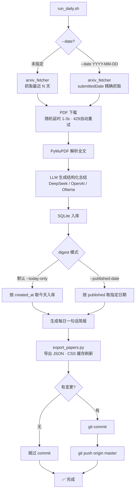

# AutoPaperReading - CV 论文智能抓取与总结

> 自动从 arXiv 抓取 CV 论文 → 下载 PDF → 生成详细中文结构化总结 → 部署 GitHub Pages 在线浏览

- 在线站点：<https://ttt-bob.github.io/autoPaperReading/>
- 公开仓库：<https://github.com/ttt-bob/autoPaperReading>

## 工作流程



## 功能一览

| 功能 | 说明 |
|------|------|
| 自动抓取 | 每天从 arXiv 抓取 CV 方向最新论文（1 API 调用 + 5 PDF 下载） |
| 日期回填 | `--date YYYY-MM-DD` 通过 arXiv submittedDate API 精确抓取某天论文 |
| 429 防护 | API 双重重试 + 代理支持 + 随机 User-Agent + 429 自动重试 |
| PDF 下载 | 自动下载并按任务分类（detection / segmentation / generation 等） |
| 中文总结 | DeepSeek API 生成详细结构化总结（作者、机构、创新点、实验结果等） |
| 本地搜索 | SQLite + 前端全文浏览，无需 Docker/Qdrant |
| GitHub Pages | 导出 JSON 后即可部署静态网页，在线分享 |
| 每日报告 | 自动生成 Markdown 摘要 |
| 断点续传 | 中断后可恢复，已入库论文不会重复处理 |
| 手动补录 | 支持传入 arXiv URL / ID 补录任意论文（包括老论文） |

---

## 快速开始

### 1. 安装依赖

```bash
# 安装 uv（如果还没有）
curl -LsSf https://astral.sh/uv/install.sh | sh

cd autoPaperReading
uv sync
```

### 2. 配置 API Key

编辑 `.env` 文件，填入你的 DeepSeek API Key（推荐，便宜 + 中文强）：

```bash
# 申请地址：https://platform.deepseek.com/api_keys
DEEPSEEK_API_KEY=sk-your-key-here
DEEPSEEK_BASE_URL=https://api.deepseek.com
DEEPSEEK_MODEL=deepseek-v4-flash
```

### 3. 抓取论文并生成总结

```bash
# 方式一：每日自动抓取（推荐）
# 会自动抓取 → 总结 → 生成报告 → 导出 → 推送，全程断点续传
./run_daily.sh
# 中断后恢复（不会重复处理已入库论文）
./run_daily.sh --resume

# 方式二：精准回填某天的论文（通过 arXiv API submittedDate 精确匹配）
./run_daily.sh --date 2026-05-20

# 方式三：只抓取入库（不生成报告和推送）
uv run python jobs/daily_ingest.py --max-results 10 --days-back 30

# 方式四：通过每日脚本补录单篇论文（会自动总结、导出、提交、推送）
./run_daily.sh --url https://arxiv.org/abs/2509.18119 --save-category gui
# --save-category 是保存/标签类别，可改成 aaa、bbb 等；只有 gui 会进入 GUI 论文地图

# 方式五：只手动入库单篇论文（不自动导出和推送）
uv run python jobs/ingest_url.py https://arxiv.org/abs/1706.03762
uv run python jobs/ingest_url.py 1706.03762                       # 直接用 ID
uv run python jobs/ingest_url.py https://arxiv.org/abs/1706.03762 --force  # 强制重处理

# 导出为前端 JSON（GitHub Pages 部署用）
uv run python jobs/export_papers.py
```

### 4. 本地预览前端

```bash
# 方式一：Python 内置服务器
cd docs && python -m http.server 8080
# 浏览器打开 http://localhost:8080

# 方式二：Streamlit 界面
uv run streamlit run app.py
# 浏览器打开 http://localhost:8501
```

---

## 每日自动运行

不需要打开 VSCode，通过操作系统定时任务实现完全自动运行。

### 方式一：crontab（推荐，简单）

```bash
# 编辑定时任务
crontab -e
```

加入以下任一行：

```bash
# arXiv 当天更新完成后运行一次（建议至少 14:00）
0 14 * * * cd /path/to/autoPaperReading && ./run_daily.sh >> logs/daily_run.log 2>&1

# 多时段重试：14 点开始；失败则在 16/18/20/22 点自动重试，成功一次当天跳过
0 14,16,18,20,22 * * * cd /path/to/autoPaperReading && ./run_daily.sh --auto >> logs/daily_run.log 2>&1
```

> `--auto` 模式会在成功运行后创建 `.daily_done` 标记文件，后续调度看到标记后直接跳过。如果当天所有时段都失败，第二天会重新尝试。

### 方式二：launchd（macOS 推荐，更可靠）

创建 `~/Library/LaunchAgents/com.user.paperdaily.plist`（**把 `/path/to` 换成你的实际路径**）：

```xml
<?xml version="1.0" encoding="UTF-8"?>
<!DOCTYPE plist PUBLIC "-//Apple//DTD PLIST 1.0//EN"
  "http://www.apple.com/DTDs/PropertyList-1.0.dtd">
<plist version="1.0">
<dict>
    <key>Label</key>
    <string>com.user.paperdaily</string>
    <key>ProgramArguments</key>
    <array>
        <string>/path/to/autoPaperReading/run_daily.sh</string>
        <string>--auto</string>
    </array>
    <key>WorkingDirectory</key>
    <string>/path/to/autoPaperReading</string>
    <key>StandardOutPath</key>
    <string>/path/to/autoPaperReading/logs/launchd.log</string>
    <key>StandardErrorPath</key>
    <string>/path/to/autoPaperReading/logs/launchd.err</string>
    <key>StartCalendarInterval</key>
    <array>
        <dict><key>Hour</key><integer>14</integer><key>Minute</key><integer>0</integer></dict>
        <dict><key>Hour</key><integer>16</integer><key>Minute</key><integer>0</integer></dict>
        <dict><key>Hour</key><integer>18</integer><key>Minute</key><integer>0</integer></dict>
        <dict><key>Hour</key><integer>20</integer><key>Minute</key><integer>0</integer></dict>
        <dict><key>Hour</key><integer>22</integer><key>Minute</key><integer>0</integer></dict>
    </array>
    <key>RunAtLoad</key>
    <false/>
    <key>KeepAlive</key>
    <false/>
</dict>
</plist>
```

加载并启动：

```bash
launchctl load ~/Library/LaunchAgents/com.user.paperdaily.plist
```

### 查看 & 管理定时任务

```bash
# 查看任务状态（LastExitStatus 0=正常）
launchctl list com.user.paperdaily

# 查看运行日志
cat logs/launchd.log

# 查看错误日志
cat logs/launchd.err

# 手动触发一次（测试用）
launchctl start com.user.paperdaily

# 取消任务（卸载，不再自动运行）
launchctl unload ~/Library/LaunchAgents/com.user.paperdaily.plist

# 彻底删除（卸载后再删文件）
# launchctl unload ~/Library/LaunchAgents/com.user.paperdaily.plist
# rm ~/Library/LaunchAgents/com.user.paperdaily.plist

# 修改时间段后重新加载
# launchctl unload ~/Library/LaunchAgents/com.user.paperdaily.plist
# launchctl load   ~/Library/LaunchAgents/com.user.paperdaily.plist
```

### 自动重试机制

`--auto` 模式的工作逻辑：

1. 检查 `.daily_done` 中是否有今天的日期 → **有则直接退出**，不执行任何操作
2. 如果是中断恢复（存在 `.run_state`）→ 自动进入断点续传模式
3. 运行完整的抓取 → 总结 → 报告 → 导出 → 推送流程
4. **全部步骤成功** → 写入 `.daily_done`，当天后续调度全部跳过
5. **中途失败** → 不写标记，下次调度自动续跑

这样配置了 `0 14,16,18,20,22 * * *` 后：
- 14:00 失败 → 16:00 自动续跑 → 18:00 成功 → 20:00/22:00 直接跳过

---

## 断点续传详解

脚本会在 `.run_state` 文件中记录当前进度，中断后恢复时：

- ✅ **已完成入库的论文**：根据 `paper_id` 去重，已有总结的直接跳过，不会重新调用 LLM
- ✅ **已完成的其他步骤**：digest / export / commit / push 直接跳过
- 🔄 **中断的步骤**：从断点继续

```bash
# 正常运行（全程约 30 分钟）
./run_daily.sh

# 中断后恢复（自动跳过已完成步骤）
./run_daily.sh --resume

# 也可以用 -r 简写
./run_daily.sh -r
```

### ingest_url.py 的断点续传逻辑

| 情况 | 行为 |
|------|------|
| 论文不存在 | 下载 PDF → 生成总结 → 入库 |
| 论文已存在，无总结 | 下载 PDF → 生成总结 → 更新记录 |
| 论文已存在，有总结 | 跳过（用 `--force` 可强制重处理） |

---

## GitHub Pages 部署（在线分享）

### 第一步：推送代码到 GitHub

```bash
cd autoPaperReading

# 初始化 git（如果还没有）
git init
git add .
git commit -m "Initial commit"

# 关联远程仓库（替换为你的仓库地址）
git remote add origin https://github.com/YOUR_USERNAME/autoPaperReading.git
git push -u origin main
```

### 第二步：在 GitHub 开启 Pages

1. 打开你的 GitHub 仓库
2. Settings → Pages → Source
3. Branch: `gh-pages` / folder: `/ (root)`
4. Save

### 第三步：每次更新数据

```bash
# 方式一：一行命令搞定全部（推荐）
./run_daily.sh

# 方式二：分步执行
uv run python jobs/daily_ingest.py --max-results 20
uv run python jobs/daily_digest.py --days 7
uv run python jobs/export_papers.py
git add docs/papers.json docs/index.html docs/gui-taxonomy.html
git commit -m "Update papers: $(date +%Y-%m-%d)"
git push
```

> **注意**：PDF 文件和数据库不提交到 Git（已加入 `.gitignore`），每次 clone 后重新抓取即可。

---

## 项目结构

```
autoPaperReading/
├── config.yaml          # 关键词、模型、代理配置
├── pyproject.toml       # uv 依赖管理
├── .env                 # API Key（不提交）
├── .gitignore           # 忽略 PDF、数据库、日志
├── run_daily.sh         # 每日全自动流程（抓取→总结→推送，支持 --date 回填）
├── run_local.sh         # 本地运行（推送到 gh-pages 分支）
│
├── app.py               # Streamlit 搜索界面（本地用）
│
├── rag/                 # 核心模块
│   ├── arxiv_fetcher.py # arXiv 论文抓取（支持日期回填 + 代理 + 429 指数退避重试）
│   ├── pdf_parser.py    # PDF 下载（按任务分类保存 + 随机 UA + 代理 + 429 自动重试）
│   ├── summarizer.py    # LLM 中文详细总结 + 标签提取
│   ├── db.py            # SQLite 元数据存储
│   └── llm_client.py    # 统一 LLM 客户端（DeepSeek / Ollama / OpenAI）
│
├── jobs/                # 定时任务
│   ├── daily_ingest.py  # 每日抓取入库（支持 --date 指定日期回填）
│   ├── ingest_url.py    # 手动补录单篇论文（传入 arXiv URL 或 ID）
│   ├── daily_digest.py  # 每日摘要报告（支持 --published-date）
│   └── export_papers.py # 导出 JSON（GitHub Pages 用）
│
├── docs/                # GitHub Pages 静态前端
│   ├── index.html       # 主页面
│   ├── style.css        # 样式
│   ├── app.js           # 前端逻辑
│   └── papers.json      # 论文数据（由 export_papers.py 生成）
│
└── data/
    ├── papers.db        # SQLite 数据库
    ├── pdfs/            # 下载的 PDF（按任务分类保存）
    │   ├── detection/
    │   ├── segmentation/
    │   ├── generation/
    │   └── other/
    └── digests/         # 每日摘要 Markdown
```

---

## 配置说明

### config.yaml

```yaml
# 抓取配置
sources:
  arxiv:
    max_results_per_day: 50

# 代理配置（可选，用于规避 arXiv 限流）
proxy:
  enabled: true                # 是否启用代理
  mode: "single"               # single=单代理 | pool=代理池 | direct=直连
  single_proxy: "http://127.0.0.1:7890"  # Clash/V2Ray 默认地址
  # proxy_pool:               # 代理池模式（多个代理随机选择）
  #   - "http://proxy1.example.com:8080"
  #   - "http://proxy2.example.com:8080"
  min_delay: 3.0               # 请求随机延迟下限（秒）
  max_delay: 8.0               # 请求随机延迟上限（秒）

# 关注方向（可增删）
topics:
  - "object detection"
  - "semantic segmentation"
  - "diffusion model"
  # 加你想关注的任何方向...

# LLM 配置
llm:
  model: "deepseek-v4-flash"    # DeepSeek（推荐）
  # model: "deepseek-v4-pro"    # 更强但更贵
  # model: "gpt-4.1-mini"       # OpenAI

# Embedding 配置
rag:
  embedding:
    model: "nomic-embed-text"   # 本地 Ollama（默认）
    dimension: 768               # nomic-embed-text = 768 维
```

### 切换模型

| 模型 | 配置方式 | 特点 |
|------|---------|------|
| DeepSeek v4 Flash | 改 `.env` 的 API Key | 便宜，中文强 |
| DeepSeek v4 Pro | 改 `config.yaml` 的 model | 更强，更贵 |
| Ollama 本地 | 改 `config.yaml` 的 model | 免费，需本地运行 |
| OpenAI | 改 `config.yaml` 的 model | 贵，质量好 |

### 代理配置

arXiv 对同一 IP 的请求频率有限制（429 限流）。本项目支持通过代理轮换出口 IP 来规避。

#### 三种模式

| 模式 | 配置 | 适用场景 |
|------|------|----------|
| single | `mode: "single"` + `single_proxy` | 本地有 Clash/V2Ray |
| pool | `mode: "pool"` + `proxy_pool` 列表 | 有多个代理服务器 |
| direct | `mode: "direct"` 或 `enabled: false` | 无代理需求/代理不可用 |

#### 配置示例

```yaml
# 方式一：单代理（Clash/V2Ray 默认配置）
proxy:
  enabled: true
  mode: "single"
  single_proxy: "http://127.0.0.1:7890"
  min_delay: 3.0
  max_delay: 8.0

# 方式二：代理池（多 IP 轮换，降低被限流概率）
proxy:
  enabled: true
  mode: "pool"
  proxy_pool:
    - "http://proxy1.example.com:8080"
    - "http://proxy2.example.com:8080"
    - "http://proxy3.example.com:8080"
  min_delay: 3.0
  max_delay: 8.0

# 方式三：禁用代理（直连）
proxy:
  enabled: false
```

#### 工作原理

```
arXiv API 请求 → 环境变量 http_proxy → 代理服务器 → 换出口 IP
PDF 下载请求  → 随机 User-Agent + proxies 参数 → 代理服务器 → 换出口 IP
```

- **User-Agent 池**：内置 7 个常用浏览器的 UA，每次请求随机选择
- **代理池模式**：每次请求随机选择代理，429 时自动切换下一个
- **随机延迟**：每次请求间隔 3~8 秒（可配置），模拟人类行为

---

---

## 常用命令

```bash
# ===== 每日自动抓取（完整流程） =====
./run_daily.sh                              # 抓取→总结→报告→导出→推送
./run_daily.sh --resume                     # 断点续传

# ===== 代理配置（编辑 config.yaml）=====
# 启用代理：设置 proxy.enabled: true + 配置 single_proxy 或 proxy_pool
# 禁用代理：设置 proxy.enabled: false 或 mode: "direct"

# ===== 按日期回填 =====
./run_daily.sh --date 2026-05-20            # 精确回填某天（API 端 submittedDate 过滤）
MAX_RESULTS=100 ./run_daily.sh --date 2026-05-09  # 指定更大结果数

# ===== 手动抓取 =====
uv run python jobs/daily_ingest.py --max-results 20 --days-back 7
uv run python jobs/daily_ingest.py --reprocess   # 强制重新处理所有论文
uv run python jobs/daily_ingest.py --date 2026-05-20     # 仅抓取该天论文

# ===== 按发布日期生成摘要 =====
uv run python jobs/daily_digest.py --published-date 2026-05-20  # 指定 arXiv 发布日期

# ===== 手动补录单篇 =====
./run_daily.sh --url https://arxiv.org/abs/2509.18119 --save-category gui  # 补录并同步到 GitHub Pages
# --save-category 是类别名，会影响 PDF 保存目录 data/pdfs/{category}/ 和入库标签；
# 可以改成 aaa、bbb 等自定义类别，只有 gui 类别会自动进入 GUI 论文地图。
./run_daily.sh --url https://arxiv.org/abs/2509.18119 --gui                # 等价于 --save-category gui

uv run python jobs/ingest_url.py https://arxiv.org/abs/1706.03762   # arXiv URL
uv run python jobs/ingest_url.py 1706.03762                          # arXiv ID
uv run python jobs/ingest_url.py https://proceedings.neurips.cc/...  # 任意 PDF
uv run python jobs/ingest_url.py URL1 URL2 URL3                     # 批量
uv run python jobs/ingest_url.py URL --force                        # 强制重处理

# ===== 报告与导出 =====
uv run python jobs/daily_digest.py --days 7      # 生成近 7 天摘要
uv run python jobs/export_papers.py               # 导出前端 JSON

# ===== 本地预览 =====
cd docs && python -m http.server 8080            # 静态页面
uv run streamlit run app.py                      # Streamlit 界面

# ===== 统计 =====
uv run python -c "from rag.db import count_papers; print(count_papers(), '篇论文')"
```

---

## 总结格式（详细版）

每篇论文的总结包含：

1. **论文基本信息** — 作者、机构/公司/团队、发表时间、开源代码地址
2. **研究背景与动机** — 要解决的问题、现有方法不足
3. **一句话总结** — 核心内容
4. **核心创新点** — 每条详细说明解决了什么
5. **方法详解** — 架构、损失函数、训练策略
6. **实验设置** — 数据集全称、Baseline、评估指标
7. **实验结果** — 具体数值、与 Baseline 对比
8. **局限性** — 计算量、适用场景、未解决问题
9. **未来研究方向**
10. **对工程/研究的启发**
11. **适合标签**

---

## 技术栈

| 组件 | 工具 | 备注 |
|------|------|------|
| 环境管理 | astral uv | 比 pip 快 10 倍 |
| 论文获取 | arxiv API | 免费官方接口 |
| PDF 解析 | PyMuPDF | 速度快 |
| LLM 总结 | DeepSeek API | 便宜 + 中文强 |
| 本地 Embedding | Ollama nomic-embed-text | 免费本地 |
| 元数据存储 | SQLite | 零配置 |
| 前端展示 | 纯 HTML/CSS/JS | GitHub Pages |
| 搜索界面 | Streamlit | 可选，本地用 |

## 许可证

MIT License
