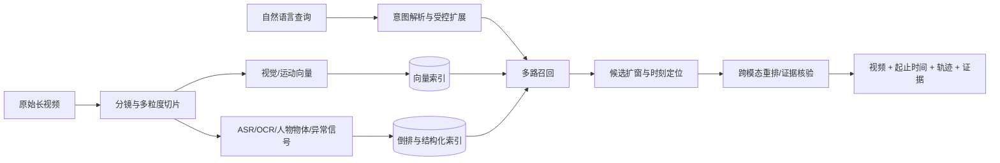

# Video Search 论文、数据集与工程实施方案

更新时间：2026-08-14

本文是在仓库原有总结上的续写与整合，不是另起一套结论。仓库当前的 Video Search 专题已经
覆盖整段视频检索、时刻检索、时序接地、异常检测、文本行人搜索、长视频问答等方向；本文进一步
把这些论文放进同一个产品流程中，回答四个问题：论文通常研究什么、一般使用什么数据集、工程上
怎么实现、最后可以做到什么程度。

## 目标

本文档面向以下应用目标：用户输入简短自然语言，例如“有人跌倒”“有人偷东西”或
“穿红衣服的人拿走商品”，系统能够在大量视频中快速召回相关视频，并进一步定位到人物、
动作对应的视频帧或起止时间段。

## 先给结论

这不是一个模型就能稳定完成的任务。更可靠的方案是“离线多粒度建索引 + 在线多路召回 +
候选片段精定位 + 证据化重排”的四层系统：

1. 用视频—文本双编码器把长视频切成窗口并建立向量索引，解决海量视频的快速召回；
2. 同时建立 ASR、OCR、人物轨迹、物体和异常分数等辅助索引，补足纯视觉语义模型的盲区；
3. 对 Top-K 候选使用 Moment-DETR 一类时刻检索模型预测起止时间，并合并重复片段；
4. 对少量候选再用 Video-LLM 判断复合条件、生成解释，但不让大模型扫描全部视频。

首个版本推荐以 **QVHighlights + Moment-DETR** 打通自然语言到时间段的闭环，以
**CLIP4Clip/InternVideo2 类双编码器**做规模化召回，再以 **UCF-Crime + XD-Violence +
VadCLIP**补充异常事件。真实业务数据必须单独做小规模时间段标注和跨摄像头留出测试；只看公开
数据集 AUC 或 Recall，无法判断线上误报率。

最终产品应返回“视频、起止时间、预览片段、匹配理由和相关人物轨迹”，而不只是一个视频级标签。
对明确可见的常见人物、动作、物体和场景可形成好用的搜索能力；对“偷窃意图”“可疑行为”这类
依赖所有权、规则或长时上下文的判断，只能作为候选发现和人工复核工具，不能承诺自动定性。

## 一、相关论文实际上分成五类任务

| 任务 | 输入与输出 | 典型论文/模型 | 适合解决 | 不能单独解决 |
| --- | --- | --- | --- | --- |
| 整段视频检索（Text-to-Video Retrieval） | 文本 → 视频/短 clip 排名 | Frozen in Time、CLIP4Clip、X-CLIP、VideoCLIP、InternVideo2 | 从大库中快速找候选，适合向量索引 | 不给精确起止时间；长视频平均池化会稀释短事件 |
| 视频时刻检索（VMR/Temporal Grounding） | 文本 + 单个视频 → 一个或多个 `[start, end]` | 2D-TAN、VSLNet、Moment-DETR、CG-DETR、MS-DETR、UniTime | “跌倒发生在哪几秒”、多片段定位 | 通常假设候选视频已知，不适合直接扫描百万段视频 |
| 视频异常检测（VAD） | 视频 → 逐帧/逐片异常分数与类别 | DeepMIL、AnomalyCLIP、VadCLIP、VERA | 打架、抢劫、事故等异常候选召回 | “异常”依赖场景；多数数据没有自由文本查询，也不等于法律/业务定性 |
| 人物/时空接地 | 文本 → 人物框、轨迹或时空 tube | 文本行人搜索、Re-ID、检测跟踪、STVG 系列 | “穿红衣的人”“哪个人拿了东西” | 仅凭人物外观不能理解完整事件，跨镜身份也有隐私和误识别风险 |
| Grounded VideoQA | 问题 + 视频 → 答案 + 证据时间段 | Grounded-VideoLLM、NExT-GQA、UniTime | 对候选结果解释、问答和复核 | 推理成本高，时间戳可能幻觉，不适合作为第一阶段索引器 |

论文指标也必须按任务解释：整段检索主要看 Recall@K；时刻检索看 R@1@tIoU 和 mAP；异常检测
看帧级 AUC/AP；人物定位看检测、跟踪或 tube 指标。把 VadCLIP 的 AUC 和 Moment-DETR 的
R@1 放在一起比较没有意义。

## 参数量口径

不同论文对参数量的统计方式并不统一：有些只报告语言模型规模，有些使用冻结的视觉主干，
有些只训练轻量定位头。因此本文优先采用论文直接报告值；论文未报告时，使用官方代码默认
配置估算，并明确是否包含冻结主干。估算值不应被当作论文官方数字。

## 推荐论文与模型

| 论文 / 模型 | 参数量 | 主要侧重 | 与目标的匹配度 |
| --- | ---: | --- | --- |
| [Beyond Caption-Based Queries for Video Moment Retrieval](https://arxiv.org/abs/2603.02363) | 没有单一新模型参数量；在 CG-DETR、LD-DETR 上修改，论文未报告完整参数量 | 研究真实短查询与详细 caption 的语言差距，以及一个查询对应多个片段时的 decoder-query collapse | 很高：直接对应“跌倒”“偷东西”等简短、欠详细的搜索输入 |
| [UniTime](https://arxiv.org/abs/2506.18883) | Qwen2-VL-7B；视觉编码器冻结，LLM 使用 LoRA（rank=8、alpha=8）；可训练参数未报告 | 统一处理短视频、长视频、第一/第三人称视频，先粗粒度召回再精确定位 | 很高，但部署和推理成本较高 |
| [Grounded-VideoLLM](https://arxiv.org/abs/2410.03290) | LLM 为 3.8B 或 7B，另有 InternVideo2-1B；实际总量大于约 4.8B/8B，精确总量未报告 | 回答视频问题的同时输出支持答案的开始、结束时间 | 很高：适合“找到片段并解释为什么” |
| [VideoCLIP](https://arxiv.org/abs/2109.14084) | 论文未报告；按官方结构估算，两路 Transformer 与投影约 177M，不含冻结 S3D | 通用视频—文本对比预训练、整段视频检索和下游迁移 | 中等：更适合作为第一阶段向量编码器，而不是最终精确定位器 |
| [QVHighlights / Moment-DETR](https://arxiv.org/abs/2107.09609) | 论文未报告；按论文和官方默认配置估算，定位网络约 4.82M，不含冻结 SlowFast/CLIP | 从自然语言同时检索多个相关片段并检测高光片段 | 很高：轻量、任务定义直接匹配 |
| [LightAIR](https://arxiv.org/abs/2608.09152) | 233.06M 总参数；基线 CMP 为 226.13M | 根据文字从人物图库中检索具有正常或异常动作的人，强调动作与人物外观解耦 | 动作语义高度相关，但本质是图像检索，不是视频时间定位 |
| [VadCLIP](https://arxiv.org/abs/2308.11681) | 论文未报告；按官方默认代码估算总计约 162M，其中可训练部分约 12.64M，CLIP ViT-B/16 冻结 | 弱监督视频异常检测，同时判断异常类别和发生帧 | 很高：适合监控异常召回，但文本通常来自预设异常类别 |
| [UCF-Crime / DeepMIL](https://arxiv.org/abs/1801.04264) | 三层可训练 FC 定位头为 2,114,113 参数，约 2.11M；不含冻结 C3D | 仅使用视频级标签训练异常片段定位 | 很适合偷窃、抢劫、打架等场景，但本身不支持开放自然语言 |

### 参数量补充说明

- Moment-DETR 的约 4.82M 是论文配置下的定位网络参数，不包含预提取特征所使用的
  SlowFast 和 CLIP。
- VideoCLIP 的约 177M 是根据 BERT-base 文本分支、六层视频 Transformer 和视频投影层
  估算，不包含冻结的 S3D。
- VadCLIP 的约 12.64M 是官方默认配置下的可训练时序适配器、GCN、提示和分类模块；
  加上冻结的 CLIP ViT-B/16 后总量约 162M。
- Grounded-VideoLLM 表格中的 3.8B/7B 是 LLM 规模，而不是完整视频系统的总参数量。

## 公开数据集与相关论文

### 数据集怎么选

| 数据集 | 规模与标注 | 对本项目的价值 | 主要缺口 |
| --- | --- | --- | --- |
| MSR-VTT | 约 10K 视频、200K 描述，整段视频—文本对 | 验证大库粗召回和双编码器 | 视频短、文本详细，没有目标事件的起止时间 |
| QVHighlights | 10,148 视频、10,310 查询、18,367 相关时刻，含多时刻和显著性 | 最适合做第一个自然语言片段检索闭环 | 视频约 150 秒且来自 YouTube，监控异常覆盖少 |
| ActivityNet-Captions | 约 20K 视频、849 小时、100K 带起止时间描述 | 长视频、多事件、时间标注规模大 | 描述更像 caption，不像用户搜索框里的短词 |
| Charades-STA | 约 6.7K 室内视频、约 16K 查询—片段对 | 室内人物动作和时间定位 | 场景较表演化，视频短，异常事件少 |
| Ego4D-NLQ | 第一视角长视频；官方 v2 train/val 约 27K 有效查询 | 长时记忆、第一视角和物体交互 | 数据申请与许可更严格；与固定监控视角差异大 |
| DiDeMo / TACoS / YouCook2 | 自然语言到时间段，分别偏日常短片/烹饪操作 | 补充动作步骤和时间边界训练 | 领域窄，不能代表安防或零售现场 |
| UCF-Crime | 1,900 个长监控视频、128 小时、13 类异常 | 偷盗、抢劫、打架、事故等异常召回 | 训练主要是视频级弱标签，没有自由文本查询 |
| XD-Violence | 约 4.7K 未剪辑视频，含音频和多种暴力场景 | 暴力、爆炸、冲突及音频辅助 | 仍是异常检测，不是开放文本时刻检索 |
| PAB | 百万级合成图文训练对，真实测试约 2K 图像 | 跌倒/受撞击 + 人物外观复合语义 | 图像而非视频，且许可限制商业使用 |
| Grounded VideoQA / NExT-GQA | 问答 + 证据时间段 | 训练“回答时给证据”与最终解释层 | 不适合直接训练大规模第一阶段召回器 |

数据选择遵循三条原则：

- 用 QVHighlights/ActivityNet/Charades-STA 学“查询—时间段”关系；
- 用 UCF-Crime/XD-Violence 学“异常候选”，不能假装它们原生支持自然语言检索；
- 用真实业务数据做最终校准，尤其要覆盖摄像头角度、夜间、遮挡、目标大小、业务事件定义和正常
  高相似负样本。

### 业务数据应补多少标注

建议先用分层标注控制成本，而不是一开始逐帧精标全部视频：

| 层级 | 建议内容 | 用途 |
| --- | --- | --- |
| L0 自动弱标注 | ASR/OCR、目标检测、轨迹、现有告警、文件元数据 | 建索引、发现候选、降低人工浏览成本 |
| L1 视频级标签 | 正常/异常、事件粗类别、场景、摄像头 | 异常分支和数据筛选 |
| L2 时间段标签 | 查询、开始秒、结束秒、相关度；允许一个查询对应多段 | 主任务训练与端到端评测 |
| L3 空间标签 | 关键帧人物/物体框、track_id、交互关系 | “哪个人/哪个物体”与证据可视化 |
| L4 困难负样本 | 弯腰但未跌倒、拿起自己的物品、打闹但非斗殴等 | 降低线上误报，是业务微调最有价值的数据 |

PoC 可先选 20–50 个高价值查询意图，每个意图收集正例、相似负例和跨摄像头样本。切分数据时必须
按原始视频、摄像头和日期分组，禁止相邻窗口分别落入训练集和测试集，否则指标会因内容泄漏虚高。

### 1. QVHighlights：最直接的自然语言片段检索数据集

[官方数据和代码](https://github.com/jayleicn/moment_detr)包含：

- 10,148 个视频；
- 10,310 条自然语言查询；
- 18,367 个相关时间片段；
- 一个查询可以对应多个不连续片段；
- 同时具有片段相关性和高光显著性标注。

它非常适合验证“自然语言查询到一个或多个时间段”的完整流程。主要内容是 vlog、新闻和
日常活动，监控异常行为覆盖有限。视频来源于 YouTube，公开的是标注和下载方式，原视频可能
随时间失效。

### 2. Beyond Caption-Based Queries：更接近真实搜索框输入

[官方仓库](https://github.com/davidpujol/Beyond_Caption-Based_Queries_for_Video_Moment_Retrieval)
提供预处理标注、特征和模型，包含：

- HD-EPIC-S1/S2/S3；
- YC2-S；
- ANC-S。

这些基准把 HD-EPIC、YouCook2 和 ActivityNet-Captions 的详细描述改写为不同程度的短查询，
重点解决训练数据是“看完视频后写出的 caption”，实际用户输入却是“几个关键词”的分布差异。

### 3. UCF-Crime：异常与犯罪行为数据

[UCF-Crime 论文](https://arxiv.org/abs/1801.04264)包含：

- 1,900 个长监控视频；
- 总时长约 128 小时；
- 13 类异常，包括 stealing、shoplifting、burglary、robbery、fighting、shooting、
  road accident 等；
- 训练集主要使用视频级标签，测试集提供异常时间标注。

它适合补充偷窃、打架、抢劫等监控领域视频，但没有原生自然语言查询。要用于开放文本检索，
需要把类别、场景和动作扩展成自然语言查询，或者为片段补充文本描述。

### 4. XD-Violence：暴力与复杂真实场景

[XD-Violence 项目](https://github.com/Roc-Ng/XD-Violence)适合暴力、冲突、爆炸等场景，并包含
音频模态。它同样不是原生自然语言时间检索数据集。VadCLIP 的
[官方仓库](https://github.com/nwpu-zxr/VadCLIP)提供 UCF-Crime、XD-Violence 的 CLIP 特征和
预训练模型下载入口。

### 5. PAB：人物异常动作的图文检索数据

[PAB/CMP 官方仓库](https://github.com/Shuyu-XJTU/CMP)包含：

- 1,013,605 个合成训练图文对；
- 1,978 张真实测试图像，即 989 个匹配对；
- 正常动作以及跌倒、被撞击等异常动作；
- 动作、人物外观和场景描述。

PAB 对“根据自然语言找到正在跌倒的人”很有价值，但目前是图像级检索，没有完整视频起止时间。
该数据集仅限科研使用，不允许商业使用。

### 6. Grounded VideoQA 与 NExT-GQA：答案加证据时间段

[Grounded-VideoLLM 官方仓库](https://github.com/WHB139426/Grounded-Video-LLM)公开了约 17K
Grounded VideoQA 标注，视频来自 ActivityNet 和 QVHighlights。
[NExT-GQA](https://github.com/doc-doc/NExT-GQA)要求模型在回答问题的同时定位视觉证据片段。

这类数据适合以下交互：

> 问：视频中这个人什么时候拿走了商品？  
> 答：发生在 35.2–41.8 秒，并返回对应视频片段。

### 7. 其他通用公开基准

- ActivityNet-Captions：长视频中的自然语言事件描述和时间区间；
- Charades-STA：室内人物动作的自然语言时间定位；
- Ego4D-NLQ：第一人称长视频中的自然语言查询定位，数据访问需要遵循 Ego4D 许可；
- DiDeMo：自然语言描述到视频时间段定位；
- YouCook2、TACoS：烹饪和操作流程中的动作步骤定位。

## 二、推荐的数据组合与统一格式

为了同时覆盖通用查询与异常行为，建议按以下方式组合数据：

| 目的 | 推荐数据 | 训练阶段 |
| --- | --- | --- |
| 整段视频—文本对齐 | WebVid、MSR-VTT 或可商用的内部视频—文本对 | 双编码器预训练/微调 |
| 通用自然语言时间定位 | QVHighlights、ActivityNet-Captions、Charades-STA、Ego4D-NLQ | 时刻定位器训练 |
| 真实短查询适配 | HD-EPIC-S、YC2-S、ANC-S + 自建搜索日志改写 | 查询增强、难例训练 |
| 偷窃、打架、抢劫等异常视频 | UCF-Crime、XD-Violence | 独立异常召回分支 |
| 跌倒等人物异常动作语义 | PAB + 自建视频时间段 | 动作/人物语义补充 |
| 带回答和证据定位 | Grounded VideoQA、NExT-GQA | 最终解释与问答层 |

异常检测数据和自然语言定位数据的标注形式不同，不能把类别名机械地当成完整查询后直接混训。
建议统一成下面的事件记录；缺失的空间标注、字幕或异常标签可以为空：

```json
{
  "video_id": "camera_07/2026-08-14/000123",
  "source_id": "camera_07",
  "duration_sec": 3600.0,
  "query_id": "q_0001",
  "query": "穿红衣服的人拿走柜台上的物品",
  "query_intent": "person_object_interaction",
  "segments": [
    {
      "start_sec": 128.4,
      "end_sec": 136.8,
      "relevance": 3,
      "event_label": "take_object",
      "track_ids": [17],
      "evidence": ["person:red_clothes", "object:counter_item"]
    }
  ],
  "hard_negative": false,
  "split_group": "camera_07/2026-08-14"
}
```

`segments` 必须是数组，因为真实查询经常对应多个不连续片段。`event_label` 是受控词表，`query`
保留用户自然语言，两者不能互相替代。所有衍生窗口还应保存 `parent_video_id`、绝对时间和特征版本，
否则模型升级后很难增量重建或追溯结果。

## 三、端到端系统方案



这张图的关键是把“全库可索引的轻模型”和“只看少量候选的重模型”分开。前者决定召回与成本，
后者决定边界、复合条件和解释质量。

### 3.1 离线处理与建索引

1. **视频规范化**：校验文件、统一时间基准，保留摄像头、日期、地点、权限等元数据；不要为了建索引
   覆盖原视频。
2. **分镜与多粒度切片**：同时建立约 4–8 秒的动作窗口、15–30 秒的事件窗口和更长的父片段；相邻
   窗口保留 30%–50% 重叠，避免事件落在切分边界。固定窗口和镜头边界可以并存。
3. **多模态解析**：抽帧并提取视频—文本 embedding；有声音时做 ASR/音频事件，有画面文字时做
   OCR；检测人和关键物体并用 tracker 形成轨迹。监控场景额外计算动作/异常分数。
4. **多索引写入**：向量索引保存语义和运动特征，倒排索引保存 ASR/OCR/标签，关系表保存
   `视频 → 窗口 → 帧 → track`。向量只用于召回，不应成为唯一事实来源。
5. **增量与版本管理**：记录模型、采样率、窗口策略和索引版本；新视频增量写入，模型升级时可并行
   建新索引并灰度切换。

第一阶段编码器优先使用可独立计算文本和视频向量的双编码器。CLIP4Clip/X-CLIP 是清晰基线；
需要更强视频表征和中英查询时可评估 InternVideo2 的检索分支。不要使用需要逐个“查询×视频”联合
前向的模型给全库建索引，它只能承担后续重排。

### 3.2 在线查询与召回

1. **查询解析**：把输入拆成主体、外观、动作、物体、场景、时间和否定条件。例如“穿红衣服的人
   没有付款就拿走商品”包含人物属性、拿取动作和一个无法单帧证实的业务条件。
2. **受控查询扩展**：为短查询补充同义表达和动作阶段，如“跌倒”扩展成“失去平衡—倒地—保持
   在地面”；保留原查询并限制扩展数量，避免大模型改写漂移。
3. **多路并行召回**：
   - 文本向量召回视频窗口；
   - ASR/OCR 关键词召回；
   - 人物/物体属性过滤；
   - VadCLIP 类异常分支召回高异常窗口；
   - 时间、摄像头、地点等结构化条件过滤。
4. **分数归一与融合**：各通道先独立校准，再用可解释的加权或轻量学习排序融合。异常分数不能直接
   与余弦相似度相加，二者量纲和先验分布不同。
5. **候选扩窗**：对命中窗口向前后各补上下文，避免只看到“倒地”而看不到“跌倒过程”，也为后续
   模型提供判断因果和交互的证据。

### 3.3 精定位、重排与结果合并

1. 把召回的 Top-K 父片段交给 Moment-DETR/CG-DETR/MS-DETR 一类定位器，预测一个或多个
   `[start, end, confidence]`；首版采用 Moment-DETR 更容易复现和改造。
2. 用 cross-encoder 或 Video-LLM 只重排 Top 20–100 个候选，检查人物、动作、物体是否同时成立。
3. 使用 temporal NMS/Soft-NMS 或区间聚类合并高度重叠结果；同一事件跨窗口时拼回绝对时间，保留
   多个不连续结果。
4. 最终分数至少区分 `retrieval_score`、`grounding_score`、`anomaly_score` 和
   `verification_score`，并通过验证集做概率校准。不要只展示一个来历不明的综合分。
5. 返回视频、起止时间、缩略图/短预览、摄像头、相关人物轨迹和证据摘要。解释只能引用实际采样帧、
   OCR/ASR 或检测结果，不能让 LLM 自由补充画面中不存在的事实。

### 3.4 推荐的模块组合

| 模块 | PoC 选择 | 规模化/增强选择 | 说明 |
| --- | --- | --- | --- |
| 视频粗召回 | CLIP4Clip 或轻量 VideoCLIP | InternVideo2 检索分支或领域微调双编码器 | 必须支持离线向量化和 ANN |
| 文本与元数据 | 关键词/BM25 + 结构化过滤 | 学习式稀疏检索 + 查询意图分类 | 对人名、编号、OCR、专有词尤其重要 |
| 时刻定位 | Moment-DETR | CG-DETR/MS-DETR；长视频再评估 UniTime | 先解决候选内的边界和多片段 |
| 异常召回 | VadCLIP | 加领域正常模式、困难负例和开放词表分支 | 只作为候选信号，不独立定性 |
| 人物与物体 | 检测器 + tracker + 属性 embedding | 跨镜 Re-ID、关系/动作模型 | 必须保存轨迹与时间对应关系 |
| 解释/问答 | 模板化证据摘要 | Grounded-VideoLLM/其他 Video-LLM | 只处理少量候选并输出证据时间戳 |

## 四、训练和迭代流程

### 阶段 A：不训练也能跑的基线

- 用预训练双编码器提取窗口向量，建立 ANN；
- 用公开 Moment-DETR checkpoint 对单视频候选定位；
- 建立人工查询集，测整段召回、时间定位和查询延迟；
- 先确认切片、时间映射、索引和 UI 没有错误，再讨论微调。

### 阶段 B：公开数据微调

- 在 QVHighlights 上复现 Moment-DETR，并统一输出多时间段；
- 加入 ActivityNet-Captions/Charades-STA，提高事件多样性；
- 用 Beyond Caption-Based Queries 的方法把 caption 改成短搜索词，训练 caption/search-query
  混合批次；
- 训练中加入同视频近邻窗口、相似动作、相同人物不同动作等 hard negatives。

### 阶段 C：业务数据校准

- 先冻结大部分编码器，只训练投影层、adapter/LoRA 或定位头；
- 正负样本按查询意图和摄像头均衡采样，困难负例优先；
- 异常分支独立训练和校准，最后在排序层融合；
- 从人工点击、跳出、结果播放位置收集弱反馈，但不能把“没点”直接当负例。

### 阶段 D：长视频与复杂推理

- 建立事件级父子索引，先粗定位到分钟级，再在候选内部秒级搜索；
- 加入 ASR/OCR/音频和人物—物体轨迹；
- 只有当检索召回已经稳定时，再引入 UniTime/Grounded-VideoLLM 做复杂问答和解释。

训练损失通常由视频—文本对比损失、时刻边界回归/分类、显著性、异常 MIL 和排序损失组成。它们
可以共享底层特征，但初期不建议端到端混成一个大模型；分支独立验证更容易发现数据或指标问题。

## 五、怎么评测才接近真实使用

### 5.1 离线指标

| 层级 | 必测指标 | 回答的问题 |
| --- | --- | --- |
| 视频/窗口召回 | Recall@1/5/10/50、mAP、nDCG | 正确视频是否进入候选集、排序是否合理 |
| 时间定位 | R@1@tIoU=0.3/0.5/0.7、mAP@不同 tIoU、mIoU | 找到的起止时间是否覆盖真实事件 |
| 多片段查询 | event recall、漏掉的 GT 片段数、重复率 | “多次跌倒/多次拿取”是否都找全 |
| 异常检测 | frame/event AP、AUC、FPR/小时、漏报率 | 是否能在不制造大量告警的情况下发现异常 |
| 人物/物体 | track recall、ID switch、属性准确率、时空 tube IoU | 找到的是否是正确的人和物体 |
| 置信度 | ECE/Brier 或可靠性图 | 0.8 分是否真的约有 80% 正确率 |

AUC 适合论文横向比较，但线上更应关注“每摄像头每小时误报多少次”“Top-10 是否有可用结果”“第一
个正确结果等待多久”。异常样本很稀少时，高 AUC 仍可能对应不可接受的误报量。

### 5.2 测试集设计

- 按摄像头/地点/日期留出，建立同域测试和跨域测试两套结果；
- 查询同时包含短词、完整句、错别字、口语、否定和复合条件；
- 单独统计小目标、遮挡、夜间、拥挤、镜头移动、事件跨切片等困难桶；
- 保留 normal-but-similar 集合，专门测试“弯腰 vs 跌倒”“拿起 vs 偷窃”等误报；
- 所有对比固定候选库规模。只在单个已知视频内做定位，会严重高估真实搜索效果。

### 5.3 推荐验收门槛

下面是项目门槛，不是论文成绩或无条件承诺；最终数值应在真实数据基线跑完后调整：

| 阶段 | 建议验收条件 |
| --- | --- |
| PoC | 覆盖 20–50 个定义明确的查询意图；Top-20 候选召回率 ≥ 85%；所有结果可追溯到正确绝对时间 |
| 可试用版 | 业务测试集 Recall@10 ≥ 80%；候选内 R@1@tIoU=0.5 ≥ 50%；Top-10 重复结果率 < 20% |
| 异常试点 | 每个重点类别单独报告事件召回；在约定召回目标下，把误报控制到业务人员可复核的数量 |
| 规模化版 | 百万级窗口下首屏 P95 达到约定 SLA；跨摄像头/跨日期测试下降可量化；索引可增量更新和回滚 |

这些门槛要按意图分别统计，不能只给 macro average。跌倒、斗殴、拿取、偷窃的可观测性和错误成本
完全不同。

## 六、能实现什么效果

### 近期可以实现

- 输入“有人跌倒”“两个人打架”“穿红衣服的人拿起箱子”，在视频库中返回相关候选及大致起止
  时间，用户可直接从事件处播放；
- 一个查询返回多个不连续片段，并按语义、定位和异常置信度排序；
- 组合 ASR/OCR、人物属性和视觉语义搜索，如“黄色工服的人靠近 3 号门”；
- 对候选结果给出证据摘要，例如“12:31–12:38 检测到人物由站立转为倒地”，支持人工复核；
- 通过离线索引避免大模型逐帧扫描全部历史视频，查询成本主要发生在少量候选上。

公开论文说明这些子能力是可行的，但数值不能直接当作业务承诺：CLIP4Clip 在 MSR-VTT 1K-A
协议报告 text-to-video R@1=44.5，X-CLIP 报告 R@1=49.3；Beyond Caption-Based Queries
针对短查询和多时刻差距，最高提升 14.82 个 mAP 点，多时刻查询最高提升 21.83 个 mAP 点；
VadCLIP 在 XD-Violence 报告 84.51% AP、在 UCF-Crime 报告 88.02% AUC。这些结果分别来自
不同任务、数据分布和候选库，不能互相比较，也不能推导出“真实监控准确率 88%”。

### 需要领域数据后才可能做好

- 小目标、固定机位、夜间和遮挡条件下的细粒度动作；
- “某个特定人”跨摄像头持续检索；
- 业务专有动作、设备操作流程和少见异常；
- 中文短查询、内部术语及外观 + 动作 + 物体多条件同时满足；
- 把误报控制到可运营水平，而不是只追求公开数据集平均 AUC。

### 不应承诺完全自动化

- 仅凭视频判断“偷窃”“故意伤害”“未付款”等意图、所有权和法律事实；
- 在画面模糊、关键动作被遮挡或事件发生在镜头外时给出确定结论；
- 对任意未见异常都保持高召回且低误报；
- 依靠 Video-LLM 的自然语言解释替代可验证的时间、人物轨迹和原始画面证据。

因此，产品定位应优先是“自然语言视频搜索 + 事件候选发现 + 人工复核提效”，而不是无人监督的
自动执法或事故定责系统。

## 七、推荐实施顺序

1. **两周级基线闭环**：选小规模内部视频，4–8 秒窗口 + 双编码器向量索引；做搜索 API 和带时间
   跳转的结果页。
2. **时刻定位**：用 QVHighlights 和 Moment-DETR 跑通训练、推理和统一 JSON；补窗口扩展、
   多片段合并和绝对时间映射。
3. **真实查询适配**：加入短查询改写、中文/领域同义词和 hard negatives；标注 20–50 个核心意图。
4. **异常分支**：接入 UCF-Crime、XD-Violence 和 VadCLIP，仅作为多路召回；用业务正常相似样本
   做阈值校准。
5. **人—物证据**：加入检测、跟踪、OCR/ASR，把匹配理由落到轨迹和真实帧上。
6. **长视频与问答**：检索层指标达标后，再引入 UniTime/Grounded-VideoLLM 对 Top-K 候选解释，
   避免一开始承担不必要的训练和推理成本。

## 八、最终优先级结论

- **架构优先级**：先召回、再定位、后解释；离线索引和时间映射的正确性比换更大的 LLM 更重要；
- **优先定位模型**：Moment-DETR，定位头轻量、任务定义直接、官方数据格式和 demo 完整；
- **优先召回模型**：先以 CLIP4Clip/轻量视频双编码器建立基线，再根据中英查询、算力和效果评估
  InternVideo2；
- **异常召回分支**：VadCLIP，可覆盖公开异常类，但必须加业务困难负例和误报/小时评测；
- **查询增强**：Beyond Caption-Based Queries，用于解决用户几个关键词与训练 caption 之间的差距；
- **核心数据**：QVHighlights + ActivityNet/Charades-STA 学时间定位，UCF-Crime/XD-Violence 学
  异常候选，用统一事件格式和真实业务标注连接两类数据；
- **长视频与解释**：有稳定 Top-K 候选和足够算力后再加入 UniTime 或 Grounded-VideoLLM。

## 九、主要原始资料

- [QVHighlights / Moment-DETR 论文](https://arxiv.org/abs/2107.09609)与
  [官方数据格式和代码](https://github.com/jayleicn/moment_detr)
- [CLIP4Clip 论文](https://arxiv.org/abs/2104.08860)与
  [官方代码](https://github.com/ArrowLuo/CLIP4Clip)
- [X-CLIP 论文](https://arxiv.org/abs/2207.07285)
- [ActivityNet-Captions 论文](https://arxiv.org/abs/1705.00754)
- [Ego4D Episodic Memory / NLQ 官方说明](https://ego4d-data.org/docs/benchmarks/episodic-memory/)
- [Beyond Caption-Based Queries 论文](https://arxiv.org/abs/2603.02363)与
  [项目页](https://davidpujol.github.io/beyond-vmr/)
- [UCF-Crime 论文](https://arxiv.org/abs/1801.04264)
- [VadCLIP 论文](https://arxiv.org/abs/2308.11681)与
  [官方代码、特征和模型](https://github.com/nwpu-zxr/VadCLIP)
- [Grounded-VideoLLM 论文](https://arxiv.org/abs/2410.03290)与
  [官方代码](https://github.com/WHB139426/Grounded-Video-LLM)
- [UniTime 论文](https://arxiv.org/abs/2506.18883)
- [InternVideo 官方仓库](https://github.com/OpenGVLab/InternVideo)

数据集下载、再分发和商业使用前需要逐项复核许可证、原视频版权及个人信息处理要求。尤其是
YouTube 派生数据、Ego4D、PAB 和监控视频，代码开源不等于数据可直接商用。
